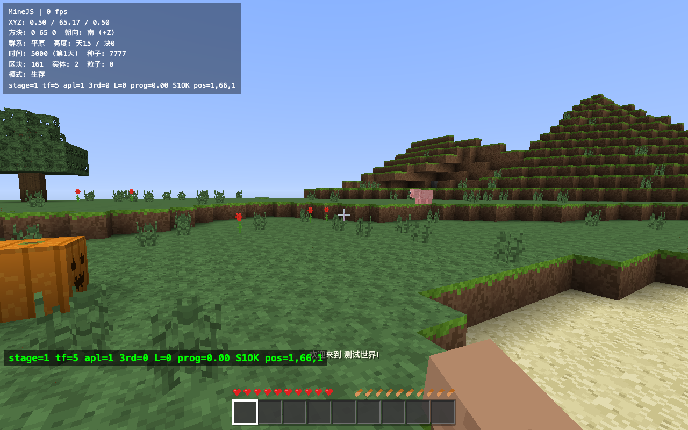

**English** · [中文](README.zh-CN.md)

# MineJS — Minecraft in the Browser

A zero-dependency, pure-WebGL2 Minecraft remake. Every texture is drawn procedurally in code — no external assets.



## How to play

**Just double-click `index.html`** (Chrome / Edge recommended; Safari / Firefox also work).

Nothing to install, no internet required. If your browser restricts `file://`, run a local server instead:

```bash
cd Game
python3 -m http.server 8000
# then open http://localhost:8000
```

## Controls

| Key | Action |
|---|---|
| Mouse | Look |
| W A S D | Move |
| Space | Jump (swim up in water) |
| Shift | Sneak (won't fall off edges) |
| Double-tap W or Ctrl+W | Sprint |
| Left click | Break / attack |
| Right click | Place block / use (hold to eat) |
| E | Inventory |
| Q | Drop held item (Ctrl+Q drops the whole stack) |
| 1-9 / scroll | Select hotbar slot |
| F3 | Debug info |
| F5 or V | Third person |
| Esc | Pause |
| Double-tap Space (Creative) | Fly (Space up / Shift down) |

## What's implemented

**World**: infinite terrain · 9 biomes (Plains / Forest / Birch Forest / Taiga / Snowy Tundra / Desert / Mountains / Ocean / Beach) · caves & ravines · ore veins (coal / iron / gold / diamond, distributed by depth) · three tree types · flowers, grass, pumpkins, cactus, mushrooms · frozen lakes & snow cover · bedrock & underground lava · seed system

**Lighting**: sky/block dual-channel flood-fill propagation · smooth lighting with ambient occlusion (AO) · warm torch light · day/night cycle (20 minutes per day) · sunrise/sunset sky gradients · starfield · sun & moon · clouds

**Survival**: health / hunger / saturation / air · fall damage · drowning · lava & fire · cactus damage · food & eating · regen when well-fed · death drops & respawn

**Block system**: 50+ block types · mining hardness & tool tiers (wood / stone / iron / gold / diamond — speed and durability tuned to MC values) · crack animation · gravity blocks (sand / gravel fall) · wall-mounted torches/ladders with support checks · glass · ice (turns to water when mined)

**Crafting & smelting**: 2×2 / 3×3 crafting (60+ recipes, mirror-aware) · furnace (fuel / progress / lit glow) · chest storage · tools / weapons / TNT / buckets / flint and steel / storage blocks

**Fluids**: water & lava flow and spread · infinite water source (2 sources) · water meeting lava forms obsidian / cobblestone · buckets pick up & place liquids

**Mobs**: pig / cow / sheep (drop meat, leather, wool) · zombie (spawns at night, burns by day) · creeper (hiss + explosion) · spawn & cap rules · death animations & drops

**Farming**: hoe tilling · seeds (from breaking grass) · wheat 8-stage growth · bread · trampling farmland · saplings grow into trees · grass spread · leaf decay

**Other**: TNT (ignite with flint and steel, chain explosions, craters) · explosion damage & resistance · particle system · procedural sound effects & ambient music (WebAudio synthesis, no audio files) · achievements · multi-world saves (auto-saved to localStorage) · creative mode · third person · F3 debug

## Getting-started tips

1. Punch a tree trunk → get logs → craft planks → 4 planks make a crafting table
2. At the table: planks + sticks → wooden pickaxe → mine stone → stone tools
3. 8 cobblestone → furnace; coal + stick → torches (very important at night!)
4. Dig a hole or build a shelter before dark — zombies and creepers come out
5. Iron ore needs a stone pickaxe; diamond needs an iron pickaxe (find it below y=15)
6. Kill creepers for gunpowder; gunpowder + sand → TNT (ignite with flint and steel)

## Tests

```bash
node test/logic-test.js      # 49 core logic tests
node test/shot.js            # headless Chrome screenshot smoke test
```

## Technical notes

- 16×16×128 chunk columns, streamed generation & unloading on demand
- Procedural textures: 512² atlas, all 16×16 pixel art generated in code (including mob skins and tool icons)
- Custom mesh generation: per-face culling + per-vertex AO / smooth lighting, lowered water surface, per-tile mipmaps
- Lighting engine: vertical skylight injection + BFS add/remove propagation, exchanged across chunk borders
- Entities: per-axis swept collision, box models (MC skin UV layout), simple AI state machines
- Saves: RLE + base64 compressed modified columns, persisted to localStorage
